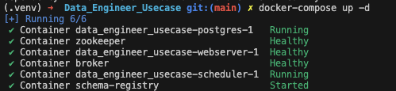

# Data Engineer Usecase:

## Problem Statement

#### Overview:
AdvertiseX, a digital advertising technology company, specializes in programmatic advertising and manages multiple online advertising campaigns for its clients. The company handles vast amounts of data generated by ad impressions, clicks, conversions, and bid requests.

#### Challenges:
1. **Data Ingestion**: Implement a scalable data ingestion system capable of collecting and processing ad impressions (JSON), clicks/conversions (CSV), and bid requests (Avro) data.
2. **Data Processing**: Develop data transformation processes to standardize and enrich the data. Handle data validation, filtering, and deduplication. Implement logic to correlate ad impressions with clicks and conversions.
3. **Data Storage and Query Performance**: Select an appropriate data storage solution for storing processed data efficiently, enabling fast querying for campaign performance analysis. Optimize the storage system for analytical queries and aggregations of ad campaign data.
4. **Error Handling and Monitoring**: Create an error handling and monitoring system to detect data anomalies, discrepancies, or delays. Implement alerting mechanisms to address data quality issues in real-time, ensuring that discrepancies are resolved promptly to maintain ad campaign effectiveness.

### Folder Structure
- **data/**: Placeholder for input data files.
- **dags/**: Contains Airflow DAG definition for orchestrating the data pipeline.
- **scripts/**: Holds Python scripts for data ingestion, transformation, and storage.
- **docker-compose.yaml**: Defines the Docker services for the entire pipeline.
- **requirements.txt**: Lists the Python dependencies required for running the scripts.

### Setup
1. **Clone Repository**: Clone the repository from the Git server.
2. **Add Data**: Populate the `data/` directory with input data files in JSON, CSV, and Avro formats.
3. **Install Dependencies**: Install the required Python libraries specified in `requirements.txt`.
4. **Set up Docker**: Ensure Docker is installed on the system.
5. **Configure Environment**: Adjust configurations in the Docker Compose file (`docker-compose.yaml`) if necessary.

### Running the Pipeline Locally

1. **Start Services**: Run `docker-compose up` command to start the Docker services defined in the `docker-compose.yaml` file.

    

2. **Verify Containers**: Check that all containers are running without errors using `docker ps`.
3. **Monitor Execution**: Monitor the execution of the pipeline using Apache Airflow UI, accessible at `localhost:8080`.
4. **Review Logs**: Review logs generated by each service/container for any errors or issues.
5. **Inspect Output**: Examine the output data stored in the chosen storage solution (e.g., PostgreSQL database).
6. **Troubleshoot**: Address any errors or discrepancies detected during pipeline execution.

### Architecture Diagram

                    +------------------------+
                    |                        |
                    |     Apache Airflow     |
                    |        Scheduler       |
                    |                        |
                    +------------+-----------+
                                 |
                                 v
                    +------------+-----------+
                    |                        |
                    |    DAGs & Tasks (Python)|
                    |                        |
                    +------------+-----------+
                                 |
                                 v
                    +------------+-----------+
                    |                        |
                    |   Kafka Ingestion &     |
                    |     Transformation     |
                    |                        |
                    +------------+-----------+
                                 |
                                 v
                    +------------+-----------+
                    |                        |
                    |     PostgreSQL         |
                    |       Database         |
                    |                        |
                    +------------+-----------+

### Additional Notes
- Need to ensure that the input data files in the `data/` directory adhere to the specified formats.
- Can customize the transformation logic in the Python scripts (`data_transformation.py`) according to specific requirements.
- Need to adjust Docker Compose configurations for scaling and resource allocation as needed.
- Monitor system resources need to be set up to ensure efficient operation and scalability, can use **Control Centre application from Confluence** 

### Further Improvements

#### Cloud Deployment (AWS)
- Utilize AWS services like Amazon S3 for storing input data files and Amazon RDS for hosting the PostgreSQL database.
- Deploy Apache Airflow on AWS ECS (Elastic Container Service) or EC2 instances for scalability and flexibility.
- Leverage AWS CloudWatch for monitoring pipeline performance and health.

#### Kubernetes Deployment
- Containerize each component of the pipeline using Docker.
- Deploy the containers to a Kubernetes cluster for orchestration and scaling.
- Use Kubernetes resources like Deployments and Services to manage and expose the pipeline components.